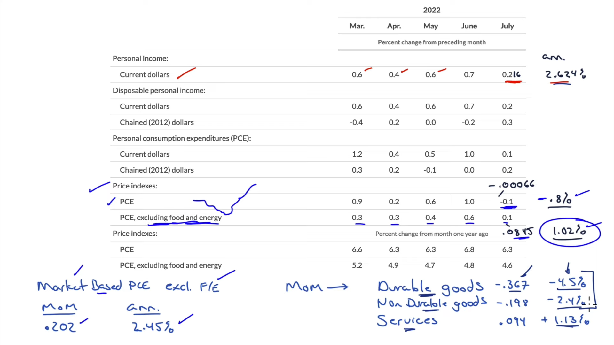
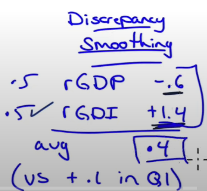
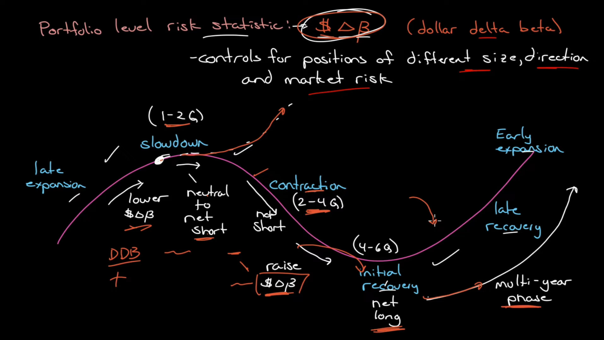
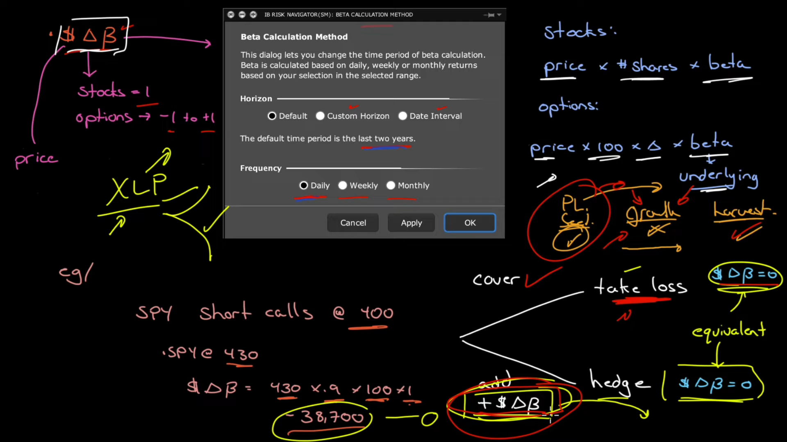
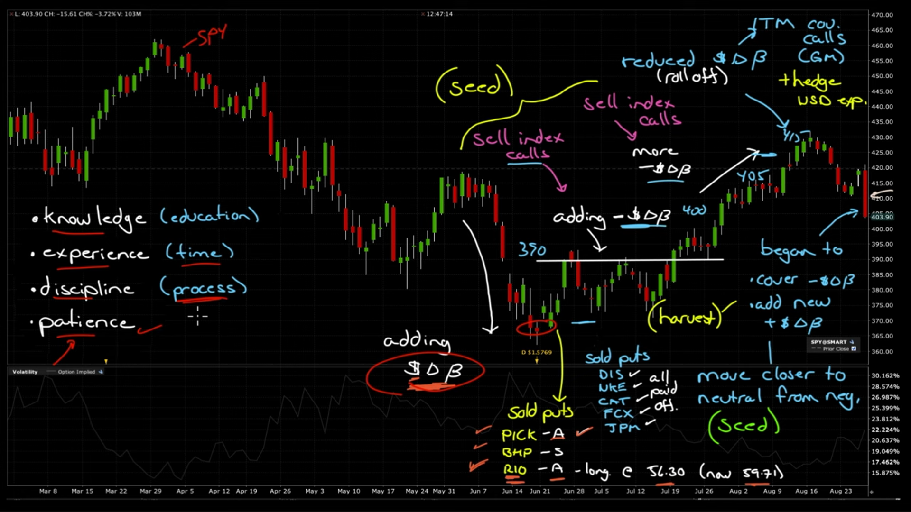

20220828 Market Outlook Aug 28 2022 - Told Ya!--------32:22

## PCE - Personal Consumption Expenditure

- Food and energy can easily go down and up right away because they are so flexible
- Decimals dont tell all the story, where to get the right amounts?
- Annualize the 1 month amounts
- Market based PCE excluding Food/Energy
  - Some of the prices in the PCE are inputed prices, meaning there is no market price for it, it is just inputed.
  - So the market based PCE is using prices you can see in the market
  - Its biggest contributor is Owners equivalent rent
- Idexes
  - Mayority of expenditures are on services
- Relation PCE and CPI
  - 2 different ways to look at what happened in pricing
    - CPI: Genneral price level
    - PCE: Cost of living, because it measures what people actualy buy
  - PCE usually comes below CPI
  - They dont contradict each other
  - They may vary usually on flexible components

    

## GDP OVERVIEW

- Annualize the quarter
- Of the annnualized, what belongs to (if summed up they shuld equal the annul number): - C: - Goods - Durable - Non-Durable - Services - I: - Fixed investments - It gets lower with higher interest rates - Inventory - G: - Federal - defense - Non-defense - State/Local - X - M: - X - M - Discrepancy smoothing - Difference between real GDP and real Gross Domestic income: - Agregate output (GDP) = Agregate expenditure (GDE) = Agregate income (GDI) - Difference are in the annualization of outliers - You should weight them equally

    

    

## Economic Calendar

- Earning season per quarter?
- Jobs report
- CPI
- Fed meeting
- Fed speaks
  - Narrative direction (bullish?)
- Housing Price index
- ADP Employment (Always wrong)
- PMI?
- Non Farm Payrolls
- Participation Rate
-

## Dollar-Deltha-Beta

ASSET MANAGEMENT (Patience):

- Single position working against you every single day causes **urgence**
- Goal: Dont feel the sense of urgence but feel invested
- Institutions vs Retail investors
  - institutional asset managers: manage risk at the portfolio level
    - Profit/Loss is an outcome
    - they manage their exposure to a risk factor
    - They dont get out all together but take on other position to lower their risk to that particular factor and stay invested
  - Retail investors: manage P/L at the position level
    - Risk is either ignored at worst or not well understood at best

### Portfolio level risk statistic: DOLLAR-DELTA-BETA

- Is one statistic for the entire portfolio, it control for positions of different size, direction and market risk
- It represent the amount of risk you are willing to take
  - Every position has a DDB, but we´ll use it at the portfolio level
  - we´ll use it to define the kind of exposure the portfolio will have
    - neutral
    - positive (bull)
    - negative (net short)
- Diversification
  - Across sector, companies, faces of the bussiness cicle (time)
    - In an expansion, you want to lower the DDB, lower the long position
    - In a slowdown, you want to get neutral to net short
      - The slowdown usually last 1-2 quarters
    - In a contraction, you want short DDB
      - The contraction usually last for 2-4 quarters
      - When the contraction is reaching it´s end, start raising DDB
    - In the Initial recovery,you net long DDB or close the short positions
      - The initial recovery last for 4-6 quarters,
    - Late recovery to early expansion
      - The late recovery lasts for multiple years
      - It usually ends when the Fed starts lowering rates
  - There are position you dont want to get rid off, because they provide the income stream of the portfolio or are very good income factories (ETF or stock that has bussiness cicle exposure but shorter volatility than the market and liquid options, so it generates income in a consisten basis)
  - Dont get married to a single bussiness cicle face
  - the in consideration the option life cicle

    

### Practical scenario

- For DDB:
  - Components:
    - Dollar refers to the price
    - Deltha:
      - For stocks is 1
      - For options, its range is from -1 to +1
    - Beta: Has to be set
      - Default: Horizon of 2 years, daily periodicity
  - Formula:
    - Stocks: Price _ #of Shares _ Beta
    - Options: Price _ 100 _ Delta \* Beta (f the underlying asset)
- Example 1:
  - Situation:
    - **short calls** on SPY at 400
    - SPY is at 430
    - DDB of this would be:
      - 430 _ 0.9 _ 100 \* 1 = -38,700
  - Options:
    - Cover (take loss):
      - DDB = 0
    - Add positive DDB from somewhere else (hedge):
      - DDB = 0
      - Stay in the position
      - Add a position where you think should be happening
        - Ex. If a contration is bound to happen, you enter XLP (staples), if the market rallies XLP goes up, if the market sells off it holds its value and the initial short position pays off

    

- Example 2:
  - Situation:
    - SPY March - August 2022
    - Sell off from March to June
    - June low
    - Index bouncing against 390
    - Last day: Big sell off
  - Actions:
    - During the June sell off (we hace lower prices) we add positive DDB (we add risk)
      - Seeding Process:
        - Sold Puts on:
          - PICK (exp. in Aug),
          - BHP (exp. in Sept),
          - RIO (exp. in Aug).
            - we want exposure to this sector
            - If the market rallies the position goes up
        - During the rally post june
          - We kept sellin calls on the index to add negative DDB
          - We kept selling puts
      - Holding Process:
        - During the post july Break-out
          - We though the pricing was amiss
            - We stop adding long position (positive DDB)
      - Harvesting Process:
        - At the same time we harvest at expiration date in Aug. We Seed again

    

1:15:17

# NOTES & RANDOM IDEAS

- The economy has 11 sectors
- Positions:

  - Covered short stratles

- Mayor

  - $66,099,000
  - 18,760 premios
  - 60 mil numeros
    - cahito: 1 - Derecho max 7,000,000
    - Serie: 20 - Derecho max 350,000
    - 3 series: 60 - Derecho max 21,000,000
  - Costo unitario: $30
  - 1/3 gana
  - Premios:
    - Directos - Serie - 3 Series: 466
      - 1 - 7m - 21m
      - 1 - 850k - 2.5m
      - 1 - 300k - 900k
      - 4 - 240k - 700k
      - 5 - 120k - 360k
      - 10 - 75k - 225k
      - 14 - 24k - 72k
      - 430 - 9k - 27k
    - Aproximacion
      - 297 premios
      - 99 numeros de la misma centena de los numeros ganadores de los 3 premios principales
    - Terminacion:
      - 604 premios
      - ultimas 4, 3, 2, cifras son iguales a los numeros de los 2 premios principales
    - Reintegro
      - 17,393 reintegros
      - ultimo digito igual al del premio mayor

- Melate:
  -
