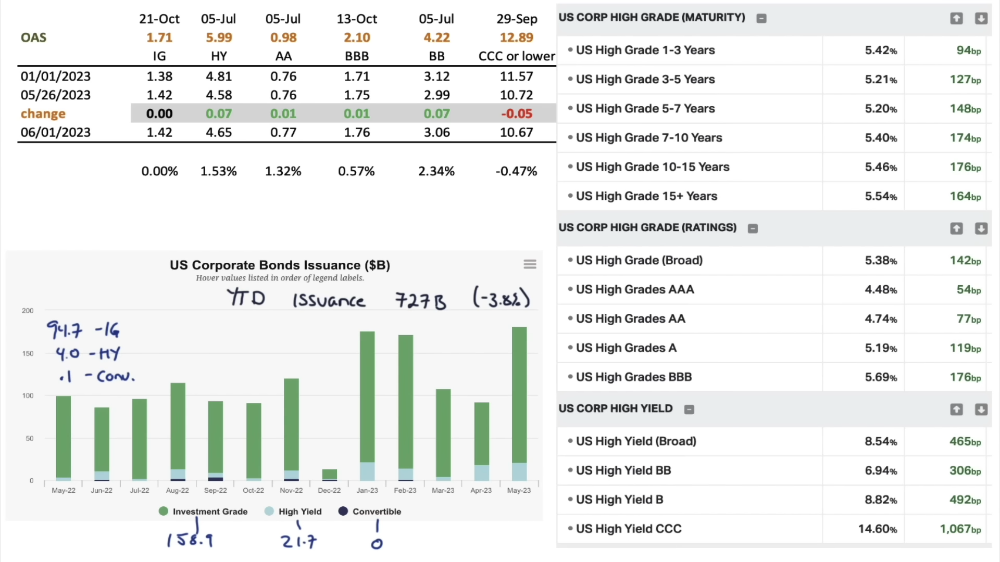
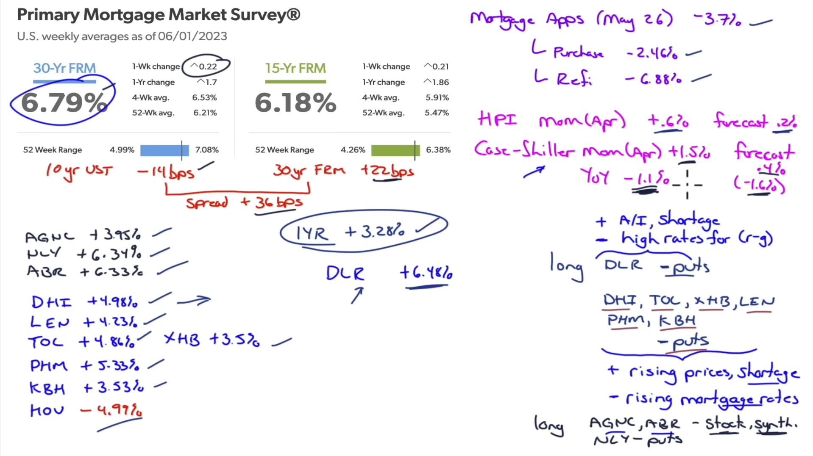
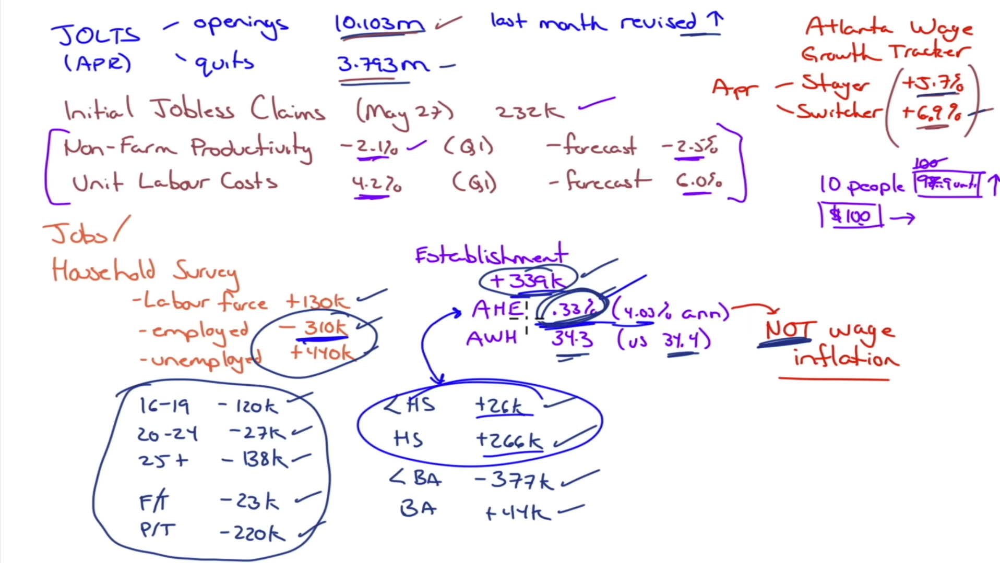
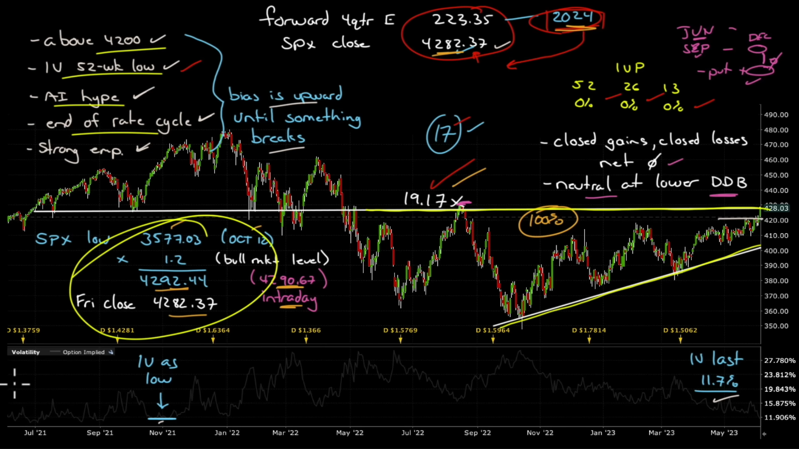
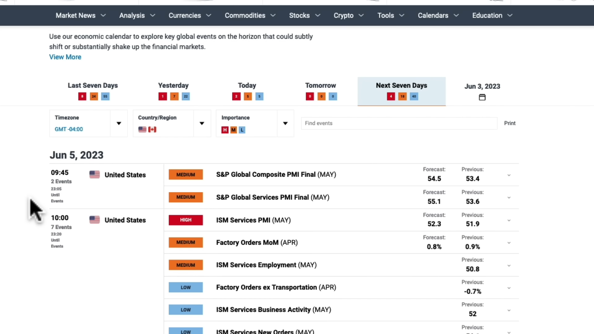

04/06/2023

# NOMINAL RATES

    

Analisis a: dia actual, semana anterior y primer dia del año.

## 1. PAR RATES

Money Market

- 1 Mo
- 2 Mo
- 3 Mo
- 4 Mo
- 6 Mo
- 1 Yr

Capital Market

- 2 Yrs
- 3 Yrs
- 5 Yrs
- 7 Yrs
- 10 Yrs
- 20 Yrs
- 30 Yrs

---

A tomar en cuenta:

- A

---

# ----------------------------

## 2. SLOPE

- 2y10y
- 5y10y
- 2y20y
- 10y30y
- 3-mos/5yrs
- 5-mos/10yrs

---

A tomar en cuenta:

- Tener en cuenta las inversiones (yield curve negativa) y el nivel mas bajo en el año
- Tener en cuenta los dias que a durado la inversion

---

# ----------------------------

# Real Rates.

    

## Real Yields

- 5 Yr
- 7 Yr
- 10 Yr
- 20 Yr
- 30 Yr
- F5y5y

## Breakeven Rates

- 5 Yr
- 7 Yr
- 10 Yr
- 20 Yr
- 30 Yr
- F5y5y

## Fed Fund Futures

- current Vs Settle

# ----------------------------

# OAS

    

- IG
- HY
- AA
- BBB
- BB
- CCC or lower

- US Corporate Bond Issuance
  - Investment
  - High Yield
  - Convertible

## . Balance Sheet Gubernamental

---

A tomar en cuenta:

- Movimientos de aumento/decremento: A que se deben:
  - US Treasuries
  - TIPS
  - Mortage Backed Securities
  - Money market: retail, institucional

# ----------------------------

# HOUSING

    

- 30-Yr FRM
- 15-Yr FRM
- AGNC
- NLY
- ABR
- DHI
- LEN
- TOL
- PHM
- KBH
- XHB
- NOU
- IYR
- DLR

- Mortage Applications
  - Purchase Index
  - Refi Index
- Housing Price Index HPI
  - Actual Vs Forecast

# ----------------------------

# JOBS

    

- JOLTS
- Atlanta Wage Growth Tracker
- Initial Jobless Claims
- Household survey
  - Labour Force
  - Employed
  - Unemployed
  - Age
  - High School Diploma or BA
  - Full time or part time job
- Establishment Survey
  - Average Hourly Earnings
  - Average Weekly Hours

# ----------------------------

# SPY

    

- Where we are? What is the bias of the market? Bullish/Bearish? Until when will it remain the same?:
  - Markets do not take the full data, you cant be right in a room full of wrong people
  - Bullish marcket that only cares about bullish data, only it will care about bearish when it happens
  - Are we above or below some mark? 4200
  - What is the Implied Volatility IV?
    - How much time has it remained in the same direction?
    - How much time has it passed since it was in the same level?
  - What are the hypes/trends of the moment? Artificial Intelligence hype
  - Take in account the momentum of the Rate cicle. I the FED has raised/lowered its rate on a particular cicle or if it has remained in a same trend.
  - Take in account the job situation.
- Where we are going?
  - Obtain the Forward Earnings Estimates and discount them to the actual price. Then compare it to the premiums

# ----------------------------

# Economic Calendar

    

- Earnings Season
- Narrative
- Economic Risks that change the direction of the market?
-

# ----------------------------

# ACONTECIMIENTOS GENERALES

A tomar en cuenta

- Anuncio de la OPEC:
  - Cortar la produccion de petroleo: Tiene un efecto inflacionario al hacer presion al alza de los precios de los energeticos.
- Anuncio de los estimulos de China: Los estimulos raramente tienen efectos con duracion alargada, y raramente cambian el comportamiento del mercado
- Problemas de vivienda en china con una sobreconstruccion de viviendas, una sobreoferta junto con una poblacion que no puede costearse la compra de una.
- Anuncio del techo de la deuda de EU:
  - Si se expande: Crea presion inflacionaria al permitir mayor gasto gubernamental.
- Implementacion de IA en la reduccion de costos
- Hype de IA:
  - Recordar la burbuja PUNTO-COM cuando no se podia realizar una buena valuacion de las empresas de tecnologia porque no se tenia una idea de como hacerlo. Ocurre lo mismo con IA. Esto se incrementa porque antes no mostraban las ganancias las empresas, ahora si, por lo que se incrementa el hype de CUANTO PUEDO LLEGAR A GANAR.
  - Es diferente del Hype de Bitcoin, porque este no se derramo a otros mercados. Pero la IA si.
  - Se verá en tiempo (años) en los flujos de efectivo, pero no de manera inmediata. Pero habrá un hype por predecir esto de manera rapida y sobrevaluara las empresas y al mercado.

# Notas Tecnicas

- Todas las recesiones estan precedidas por un mercado de capitales con inversion (de la yield curve)
  - Una inversion de la curva se da cuando la tasa de una maduracion mayor (10 años) es menor que la tasa de una maduracion menor (5 años)
- FOMC
- CPI
- Jobs Report
  - Mixes the types of job with the cualification of the individuals along with the pay they are getting
  - It is not a good measure of wage inflation because it is reflecting a mix of the jobs
- PCE
- New York Fed Effective Fund Rate EFFR
- Reverse Repo
- Rate Increase and Rate Effect are different:
  - Cause: Fed increases the target rate
  - Effect: Still has to be felt, there are lags in it, that is why the EFFR is important.
  - Al analizar empresas, fijarse en la deuda variable con madures menor a 18 meses pues muy problablemente todavia no ha tenido el efecto de los movimientos en la tasa.
- Negative Productivity raises unit costs
- Si los mercados de capitales dependen mucho de las acciones del banco central (intervenciones del BC) y del gasto gubermanetal (estimulos fiscales) estamos viendo el fin del capitalismo. Cuando esto ocurre, las ganancias obtenidas de la actividad capitalista NO son resultado del gasto de los consumidores sino de los que pagan impuestos. Entonces se deberia aumentar la tasa de impuestos.
- Con el paso de las decadas los estimulos fiscales son mas comunes.
- Bull Market Confirmation: $$PrecioCierre > PrecioCierreMasBajo * 1.2$$
- ***

- 20230604 - Market Outlook for June 4 2023 - I've seen this movie before.
