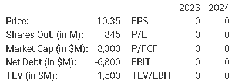

# ROIVANT SCIENCES LTD ROIV

<!---
Follow link to see original:

https://www.valueinvestorsclub.com/idea/ROIVANT_SCIENCES_LTD/5365271522

December 13, 2023 - 8:19am EST by aviclara181
-->

## Structure

1. Table with Specific Data
2.

## 1. Table with Specific Data

Start with specific data at the moment you are writing the valuation.

    

## 2.
